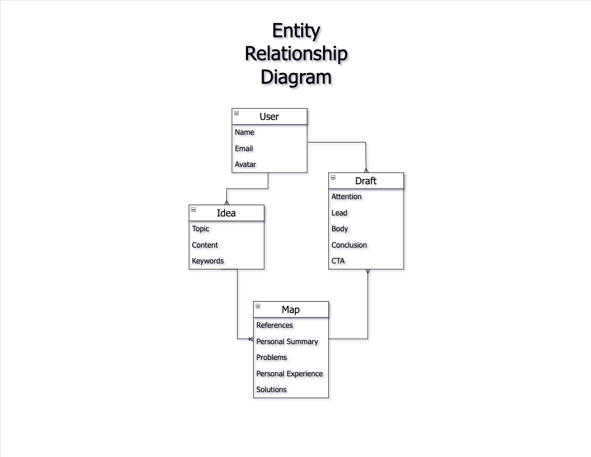

# Queue Map

### July 19, 2023

#### By: Taaj Andrews

[GitHub](https://github.com/TaajAndrews) - [LinkedIn](https://linkedin.com/in/taajandrews) - [Trello](https://trello.com/b/JO5iJbEG/queuemap)

### **Description**

Document and organize your unique perspectives with Queue Map. Identify what makes sense to you and connect the dots for others. Good ideas are forgotten. Great ideas change the world!

### **Technologies**

- HTML
- CSS
- JavaScript
- React
- MongoDB
- Mongoose
- Express
- Node.js
- Figma

### **Getting Started**

As a user, you will be able to capture ideas that spark excitment and wonder. Queue Map helps you gather the best ideas and craft original perspectives for impactful writing.

### **Screenshots**

ERD

#### **Credits**
